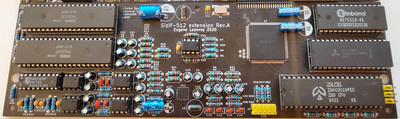

## Sizif-512 extension

Extension board for [Sizif-512](https://github.com/UzixLS/zx-sizif-512).

### Features
* Turbo Sound FM
* General Sound (12MHz / 512Kb RAM)
* SAA1099
* MIDI sound

### Changelog & current status
Work in progress!
* Rev.A - first release. Please note the [errata](pcb/rev.A/ERRATA.txt).
* Rev.A1 - coming soon
